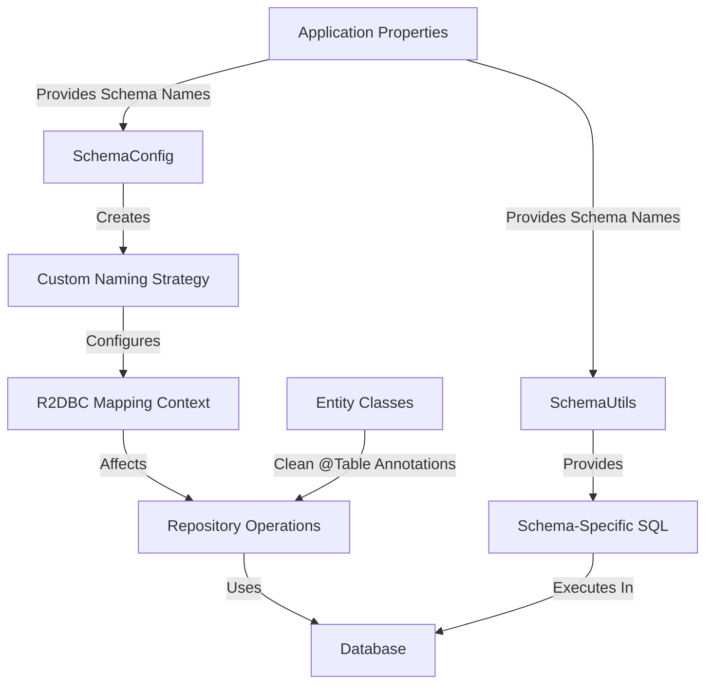
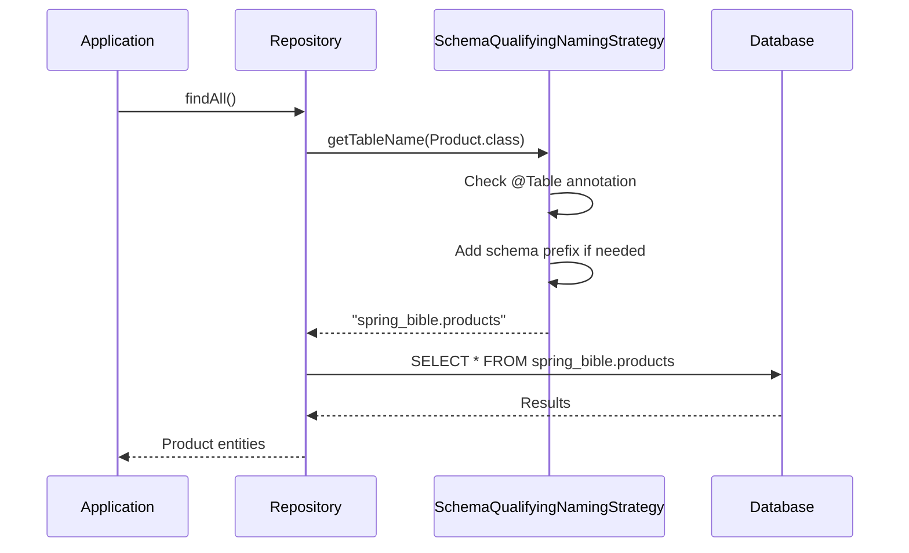
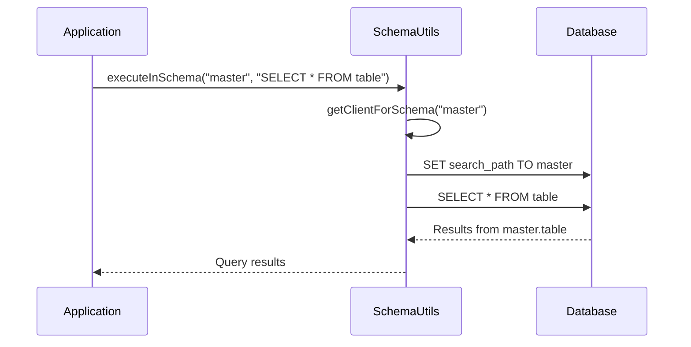
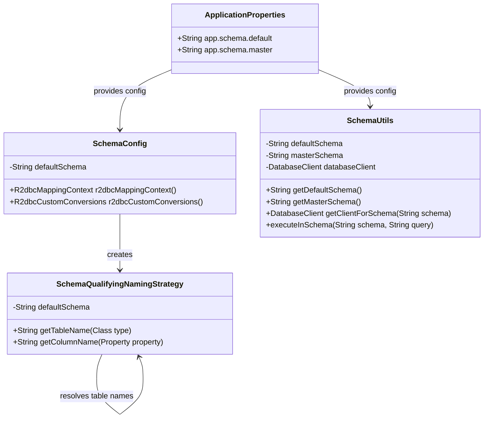

# Schema Management Flow Diagrams

These diagrams illustrate how the multi-schema solution works in our Spring Framework Bible application.

## Component Interaction Diagram

## Schema Resolution Flow

## Cross-Schema Query Flow

## Schema Configuration Structure

